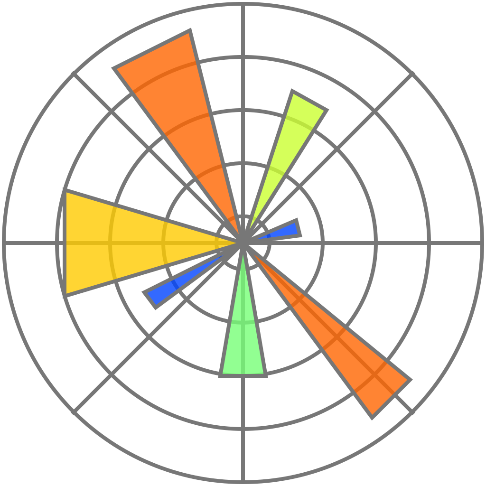
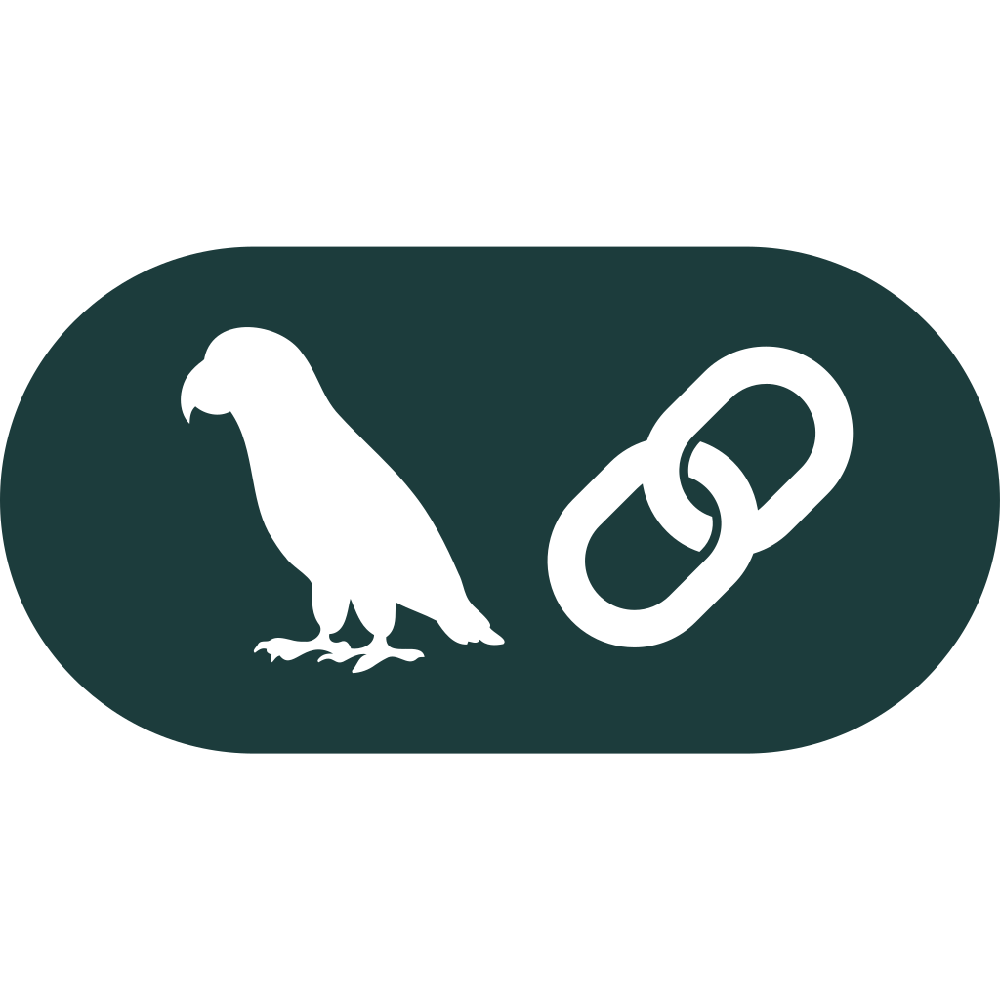

  <h1>👋 Hello there, I'm Anis</h1>

  <b>Data Enthusiast 📊</b> | <b>Football Fan ⚽</b>

  
  <q><i> Where data sparks the light of revelation. ✨</i></q>
  

<h2>📜 About Me</h2>

I'm a Data Scientist at the start of my journey in the vast world of data. My journey began during a <b>6-month internship</b> at <a href='https://caar.dz/'>CAAR</a>, an insurance company in Algeria, where I developed a <b>data analysis dashboard</b> a project that sparked my passion for turning data into actionable insights.

I am now a <b>Data Science intern</b> at <a href='https://www.djezzy.dz/'>Djezzy</a>, where I continue to build on my skills and gain hands-on experience in the field of data science.

This profile showcases my journey so far, including projects in <b>data analysis</b>, <b>visualization</b>, and <b>machine learning</b>, with a focus on real-world applications and insights.

<h2>📧 Contact Me</h2>

For more information, collaborations, or if you'd like to connect on data science or football analytics, feel free to reach out!

<table border="0" style="width: 100%; text-align: center;" align="center">
  <tr>
    <td><a href="mailto:guechtoulianiss7@gmail.com">
<b>Email</b>
</a></td>
    <td><a href="https://www.linkedin.com/in/anis-guechtouli/">
<b>LinkedIn</b>
</a></td>
    <td><a href="https://www.kaggle.com/anisguechtouli">
<b>Kaggle</b>
</a></td>
    <td><a href="files/Anis-Guechtouli-EN.pdf">
<b>Resume</b>
</a></td>
    <!--'Resume image from : Flaticon.com-->
    <!--'Resume was made using : app.FlowCV.com-->
  </tr>
</table>

I look forward to connecting with you!

<h2>⭐ Tech Stack</h2>

Throughout my learning journey in data science I have developed expertise in various skills and tools. I've used these in a wide range of projects, from initial data analysis to building machine learning models.
 Here's an overview of what I've worked with :

<h3>Programming</h3>
<table style="width: 100%; text-align: center;" align="center" border="0">
  <tr>
    <td>
Python
</td>
    <td>
Pandas
</td>
    <td>
Numpy
</td>
    <td>
Matplotlib
</td>
    <td>
Plotly
</td>
  </tr>
  <tr>
    <td>
BeautifulSoup
</td>
    <td>
Scikit-learn
</td>
    <td>
Pyspark
</td>
    <td>
LangChain
</td>
    <td>
Streamlit
</td>
  </tr>
</table>

<h3>Database Management</h3>
<table style="width: 100%; text-align: center;" align="center" border="0">
  <tr>
    <td>
SQL
</td>
    <td>
SQLite
</td>
    <td>
MySQL
</td>
    <td>
phpMyAdmin
</td>
    <td>
Oracle
</td>
  </tr>
</table>

<h3>Data Visualisation</h3>
<table style="width: 100%; text-align: center;" align="center" border="0">
  <tr>
    <td>
Tableau
</td>
    <td>
PowerBI
</td>
    <td>
Excel
</td>
  </tr>
</table>

<h3>Development</h3>
<table style="width: 100%; text-align: center;" align="center" border="0">
  <tr>
    <td>
Jupyter
</td>
    <td>
Kaggle
</td>
    <td>
Git
</td>
    <td>
Github
</td>
  </tr>
</table>
